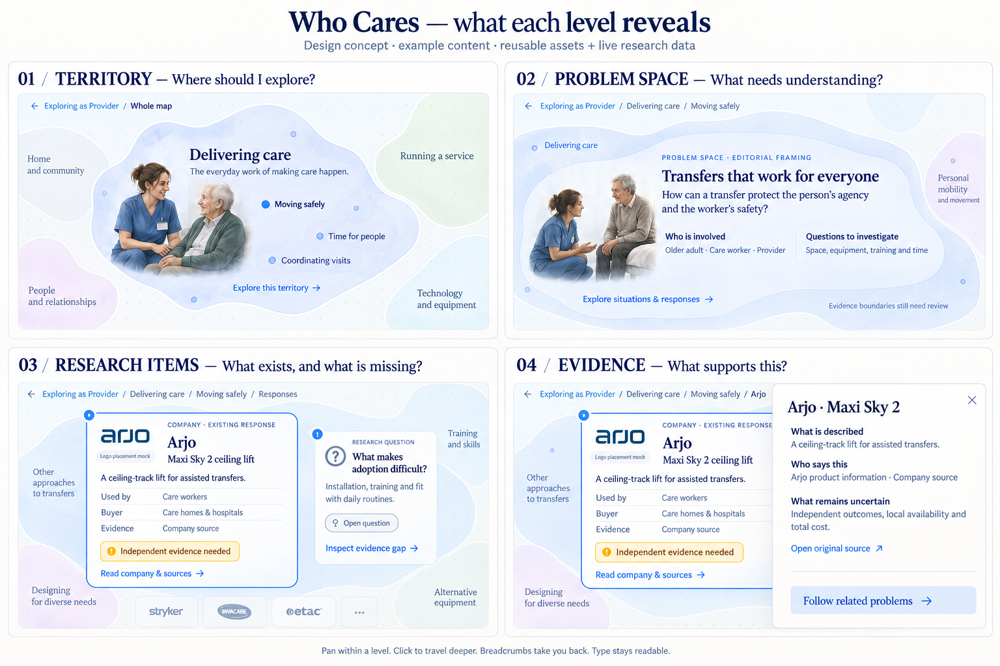

# Atlas layer design concept — 8 October 2026

The generated board is a proposal for reusable visual components, not a production map or verified taxonomy. It follows the user's current direction: fixed reading levels, Prezi-style spatial travel, panning within a level, stable text sizes and a shared breadcrumb path beginning with the perspective.

| Level | Discovery question | Information to display |
| --- | --- | --- |
| Territory | Where should I explore? | Human-readable title, one-line scope, independent illustration, a few meaningful subtopics. Avoid long copy and raw inventory counts as the headline. |
| Problem space | What needs understanding? | Bounded friction or question, affected stakeholders, situation, open questions and evidence status. Connections need sourced relationships; company tags cannot establish a problem taxonomy. |
| Research item | What exists or is missing? | Distinct company, research-question and evidence item styles. Companies use official logos, names, concrete offering, user/buyer, source type and uncertainty. Questions use a question marker and evidence gap, not a company logo. |
| Evidence reader | What supports this? | Claims, attribution, sources, scope, dates and unknowns. Retain selected map item and camera; open a reading sheet without shrinking text. |

Alphabetical ranges may remain an explicit directory fallback, but should not be the main discovery layer. Do not fabricate semantic clusters from names to replace them. The graph needs independently researched problem spaces and relationships.

Logo contract: store the official asset URL, source and retrieval date; cache a suitable static asset for the static site; preserve aspect ratio on a neutral logo well. Never synthesize production logos or imply endorsement. Missing/unverified assets receive a neutral initials fallback. Current records have /api/logo/... references, which must be resolved or exported before use on this static site. Generated board logos are placement mocks.

## Critique
The first image over-decorated the map with trees and shrank the selected item when opening evidence. The refinement requests a clean world-anchored dot grid and unchanged item typography/size beneath the reader. Illustration and content remain independent. The example problem framing is editorial and not validated research. The image does not prove large-dataset discoverability, accessible contrast, responsive layout or camera behavior.

## Generation
Built-in image generation, ui-mockup. Initial prompt and targeted refinement are preserved below. Production should implement live text, CSS/SVG territories, official logo assets and independent portrait assets, never embed this board as the interface.

### Initial prompt
Use case: ui-mockup.
Create a beautifully polished, highly legible large landscape design review board for the Who Cares research atlas. Four equal spacious panels in a precise 2 by 2 grid, each showing a cropped view of the SAME pannable spatial map at a different deliberate reading level. This is a design mock, NOT a baked map asset. Title above panels: "Who Cares — what each level reveals". Small subtitle: "Design concept · example content · reusable assets + live research data".
Visual style: refined editorial care-research publication, warm near-white paper, deep ink navy, elegant readable serif headings and crisp sans-serif body, generous whitespace, very soft translucent irregular lavender / sage / pale-blue territories, faint subtle dot grid on the world, professional detailed painted human illustrations with warm natural faces and soft edges (like a sophisticated editorial illustration of a brown-haired care worker in blue scrubs, not primitive SVG stick people or flat vector). Independent illustration vignettes around text, NOT a detailed landscape painting. SAME heading and body type sizes in all four panels. No giant stretched pill-shaped cards, no alphabetical title ranges, no meaningless giant record numbers, no dashboards, scores or invented research stats. All copy below is design example content; don't invent quantitative findings or quotations.

Panel 1 heading outside frame: "01 / TERRITORY — Where should I explore?"
Inside frame breadcrumb: "Exploring as Provider / Whole map".
A large organic blue-lavender region "Delivering care" with one-line descriptor "The everyday work of making care happen." Small separated painted vignette of a care worker and older adult in conversation, respectful capable adults.
Three compact readable topic labels spatially placed inside the region, each a neat text label rather than cards: "Moving safely", "Time for people", "Coordinating visits". Tiny cue "Explore this territory →". Partial neighbouring green region labelled "Running a service" at edge establishes spatial context. Region size not importance. No paragraphs.

Panel 2 heading: "02 / PROBLEM SPACE — What needs understanding?"
Breadcrumb: "Exploring as Provider / Delivering care / Moving safely".
Same blue parent contour retained at edges. One wide low organic area containing clear title "Transfers that work for everyone", labelled "PROBLEM SPACE · EDITORIAL FRAMING". Core text "How can a transfer protect the person’s agency and the worker’s safety?" A smaller independent painted vignette of a professional discussing a transfer with an older person, not physically lifting.
Two subordinate neatly typeset discovery blocks in open space: "Who is involved" with "Older adult · Care worker · Provider"; and "Questions to investigate" with "Space, equipment, training and time". Clear action "Explore situations & responses →". Tiny muted note "Evidence boundaries still need review". A neighbouring problem label partly visible. No company logo at this level.

Panel 3 heading: "03 / RESEARCH ITEMS — What exists, and what is missing?"
Breadcrumb: "Exploring as Provider / Delivering care / Moving safely / Responses".
Within the map show two visually DISTINCT reusable item types beside each other, wide readable surfaces with subtle borders rather than tall bubbles.
Company item occupies two thirds: a recognisable navy typographic Arjo logo at top left in white logo well, title "Arjo", overline "COMPANY · EXISTING RESPONSE", subtitle "Maxi Sky 2 ceiling lift". A concise content sentence "A ceiling-track lift for assisted transfers." Three aligned label-value rows "Used by — Care workers", "Buyer — Care homes & hospitals", "Evidence — Company source". Small amber outlined status "Independent evidence needed". Footer action "Read company & sources →". Small neutral label "Logo placement mock" below the logo; actual product must use verified official asset.
Alongside: a smaller RESEARCH QUESTION node, no logo, a restrained outlined question glyph, title "What makes adoption difficult?", text "Installation, training and fit with daily routines", status "Open question", action "Inspect evidence gap →".
Small additional faded logo-tile silhouettes behind for extensibility. Nodes retain relative world positions. No invented traction figures.

Panel 4 heading: "04 / EVIDENCE — What supports this?"
Breadcrumb: "Exploring as Provider / Delivering care / Moving safely / Arjo".
Left half remains the map with selected Arjo item and one neighbouring research-question item, unchanged positions. Right half is an elegant off-white reading sheet, clearly connected to selected node, with close control and title "Arjo · Maxi Sky 2".
Short structured text:
"What is described"
"A ceiling-track lift for assisted transfers."
"Who says this"
"Arjo product information · Company source"
"What remains uncertain"
"Independent outcomes, local availability and total cost."
Visible modest source link "Open original source ↗".
At bottom, a quiet next action "Follow related problems →".
Small footer under full board: "Pan within a level. Click to travel deeper. Breadcrumbs take you back. Type stays readable."
Ensure extraordinary typographic hierarchy, high legibility, restrained humane polished real product design, meaningful differentiated visual identity by entity type. Present polished realistic web UI mockups, no device frames.

### Refinement prompt
Refine this Who Cares UI design board, preserving its four-panel layout, wording, typography, color palette, portraits, logo-led company item and editorial hierarchy. Change only two details: (1) Remove ALL decorative tiny trees, houses, roads, landscape scenery from every map background. Replace them with a very subtle sparse dot grid and clean softly translucent organic territory shapes, retaining neighboring territory labels. Painted portraits remain independent crisp vignettes. (2) Panel 04: opening the evidence sheet must NOT shrink or reformat the selected Arjo map item. Show the SAME full-size company item, same title/body size and content as Panel 03, staying on the left of the evidence sheet, naturally cropped/occluded at viewport edges if necessary. The evidence panel overlays on the right and has the same contents. No miniaturized company card. This should demonstrate that the camera remains in place while the reading panel opens. Keep all existing board headings and the bottom interaction caption. The result is a scalable spatial interface with reusable assets, not a painted scene. High fidelity polished presentation.

## Selected mock

The refined board removes scenic decoration and keeps the company item full-size when the reader opens. It remains a design proposal: exact responsive geometry and official logo sourcing need implementation, and the current company-derived retrieval hierarchy does not become a validated problem graph through styling.
