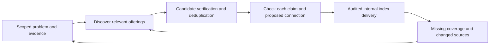

# Internal catalog cleanup — 8 October 2026

Postgres remains the system of record. Problems, responses and evidence keep stable graph identities. Providers and their particular offerings must be distinguished in research; a company tag is not a problem-to-solution relationship.

## Applied internal result

Tested and populated on Neon `br-weathered-sound-b2r4ua1l`, whose 652 original entry fingerprints matched primary at inspection. No primary records were deleted or overwritten. `atlas.content_reviews` holds append-only, batch-audited dispositions; `atlas.catalog_read_model` supplies the active projection. A replacement stops being visible if its original basis changes. Holds require an explicit superseding decision.

| Catalog disposition | Records |
| --- | ---: |
| Retain existing research, without new factual certification | 390 |
| Correct from inspected source (Rhem) | 1 |
| Hold (139 already unpublished, 25 newly excluded) | 164 |
| Reclassify funding rules out of companies | 22 |
| Archive historical themes/venture hypotheses from active browsing | 75 |

The internal export contains **391 active company/offering records**. All 652 original entries, 75 legacy archive records and source/history rows remain. Navigation labels survive as explicit view metadata, without presenting archived analyst judgments as evidenced problems. Illustrative stories no longer link to archived claims or automatically substitute products for missing problems.

One graph card is also excluded: `wc-object-8720e6b667db28b538528f6e` describes counselors' ratings of support use, not an institutional response. Its finding, quotations and sources remain preserved pending contextual mapping. The six earlier findings remain supported within their reviewed scopes, but the old six-item delivery receipt does not prove six correctly typed visible cards after this correction.

Rhem's replacement uses the captured official preorder page: distinct tabletop robot and Halo sensor, provider-attributed capabilities and limitations, US$1,099/US$1,299 pricing, US-only ordering and planned January 20–31, 2027 dispatch. It does not claim shipment occurred or establish medical performance. Product imagery and official site icon are internal media references, not independent evidence or a public reuse license.

## Audit scope and limits

All 652 entries were structurally screened against entity type, existing publication, closure flags and saved support assessments. Auxiliary checks covered 2,908 evidence rows, 135 funders, 98 funding links, 84 DiGA enrichment records, 199 discovery-inbox rows and 75 legacy records. No orphan entry/funder references were found by these checks. Six already-unverified quotations are excluded from the matched-passages view; their unpublished drafts were not promoted. A quote-match flag is not semantic verification.

This is **not renewed factual verification of every claim**, funding amount, legal provision or regulatory status. Saved critique was used for specific repair holds, not a blanket quality-score cutoff. Remaining records visibly retain research uncertainty. Insolvency triggers a current-availability hold, not an invented assertion that every product ceased. Reclassification does not automatically turn funding rules into validated legal facts.

The detailed per-record audit and pre-change inventories are outside Git in the local runtime. Public UI deployment and primary-database activation were not performed. The local index is the checked internal delivery surface.

## Next research loop

Discovery includes startups, established providers, public services and nonprofits. Candidate verification checks the provider, particular offering, capability, geography, maturity, access/price, and evidence of outcomes separately. Each proposed connection names the barrier and supporting mechanism; “addresses” must not imply proven effectiveness. Shared crawl cache, snapshots, follow-ups, budgets and logs serve both problem and solution assignments.
